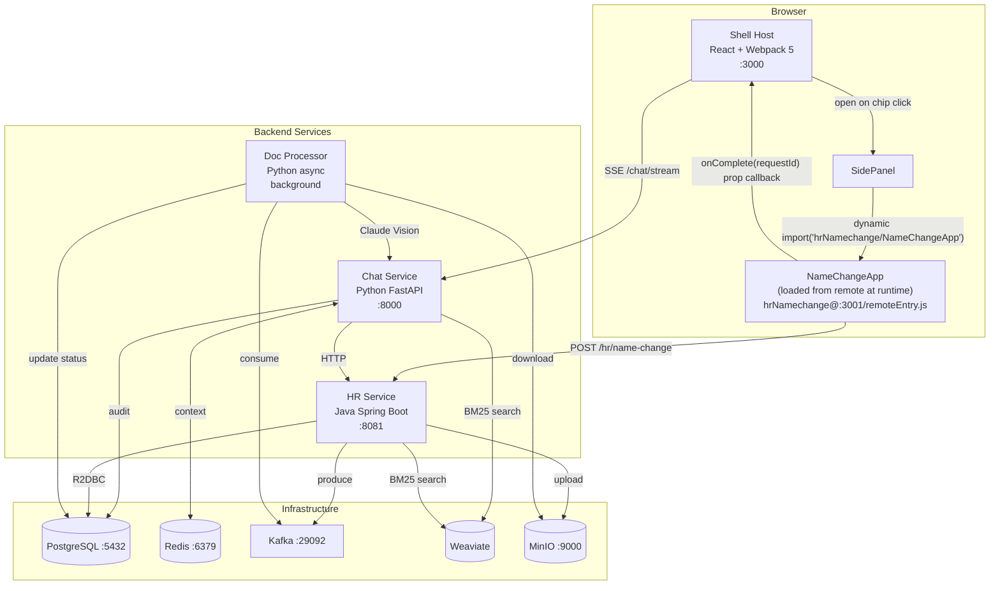
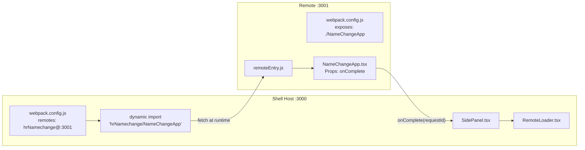
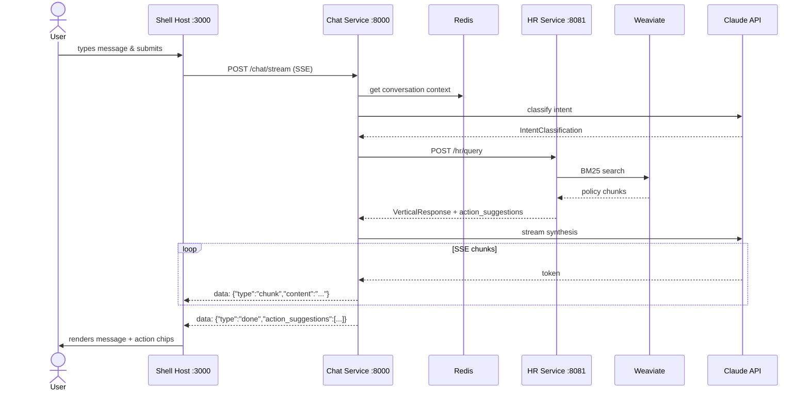
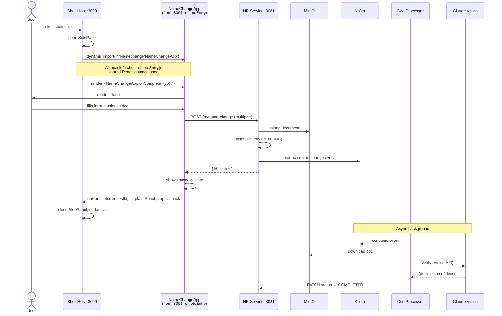

# Architecture — EKAP React MFE

## Integration Pattern: React Webpack 5 Module Federation (Host + Remote)

Both the shell and the HR name-change mini-app are standard React + Webpack 5 apps. Webpack's Module Federation plugin lets the shell (host) load the mini-app's React component bundle at runtime from a separate origin without build-time coupling. The shell passes a typed `onComplete` React prop directly to the remote component — no iframes, no `postMessage`.

---

## System Overview



---

## Service Catalogue

| Service | Image / Build | Port | Language | Responsibility |
|---|---|---|---|---|
| shell (host) | `./frontend/shell` | 3000 | React 18 + Webpack 5 | MFE host: chat UI, action chips, side panel, MFE consumer |
| hr-namechange (remote) | `./frontend/remotes/hr-namechange` | 3001 | React 18 + Webpack 5 | MFE remote: exposes `NameChangeApp` component via `remoteEntry.js` |
| chat-service | `./backend/chat-service` | 8000 | Python FastAPI | Intent classification, vertical routing, Claude streaming, Redis context |
| hr-service | `./backend/hr-service` | 8081 | Java Spring Boot WebFlux | HR policy RAG, name-change workflow, MinIO upload, Kafka producer |
| doc-processor | `./backend/doc-processor` | — | Python aiokafka | Kafka consumer; Claude Vision doc verification; DB status updates |
| postgres | postgres:16 | 5432 | — | Chat history, audit log, name-change request state |
| redis | redis:7 | 6379 | — | Conversation context (last N turns per session) |
| kafka | confluentinc/cp-kafka:7.6.0 | 29092 | — | Async event bus for document processing |
| weaviate | semitechnologies/weaviate | 8080 | — | Vector store; BM25 search over HR policy chunks |
| minio | minio/minio | 9000/9001 | — | S3-compatible blob store for legal documents |

---

## Module Federation Wiring



**Shell `webpack.config.js`:**
```js
new ModuleFederationPlugin({
  name: 'shell',
  remotes: {
    hrNamechange: 'hrNamechange@http://localhost:3001/remoteEntry.js'
  },
  shared: {
    react:     { singleton: true, eager: true, requiredVersion: '^18.3.0' },
    'react-dom': { singleton: true, eager: true, requiredVersion: '^18.3.0' }
  }
})
```

**Remote `webpack.config.js`:**
```js
new ModuleFederationPlugin({
  name: 'hrNamechange',
  filename: 'remoteEntry.js',
  exposes: { './NameChangeApp': './src/NameChangeApp' },
  shared: {
    react:     { singleton: true, eager: true, requiredVersion: '^18.3.0' },
    'react-dom': { singleton: true, eager: true, requiredVersion: '^18.3.0' }
  }
})
```

**Shell consumption:**
```tsx
const NameChangeApp = lazy(() => import('hrNamechange/NameChangeApp'));

<Suspense fallback={<Spinner />}>
  <NameChangeApp onComplete={(requestId) => handleComplete(requestId)} />
</Suspense>
```

---

## Chat Data Flow



---

## Name Change Flow (Module Federation Props Pattern)



**Key difference from iframe pattern:** `onComplete` is a plain JavaScript function reference passed as a React prop. There is no cross-origin boundary, no `postMessage`, no event listener setup — the call is synchronous and type-safe.

---

## Frontend Shell Architecture

```mermaid
graph TD
    A[App.tsx] --> B[ChatPanel.tsx]
    B --> C[ChatBubble.tsx]
    B --> D[ActionChip.tsx]
    B --> E[SidePanel.tsx]
    E --> F["RemoteLoader.tsx<br/>(Suspense boundary)"]
    F -->|"import('hrNamechange/NameChangeApp')"| G[NameChangeApp<br/>from remote bundle]
    G -->|"onComplete prop"| E
    B --> H[chatService.ts]
    H -->|SSE| I[/chat/stream]
```

---

## Comparison with Iframe Pattern

| Aspect | Iframe (`ekap-iframe`) | Module Federation (`ekap-react-mfe`) |
|---|---|---|
| Mini-app isolation | Full origin isolation | Shared JS heap, shared React instance |
| Communication | `postMessage` (async, stringly-typed) | React props (sync, typed) |
| Shared state | Not possible | Can share React context / Zustand stores |
| Error boundary | iframe crashes silently | Shell can catch with React ErrorBoundary |
| Dev experience | Two separate dev servers, no type sharing | Single shared TypeScript interface |
| CORS needed | Yes (between origins) | No (same page, different bundles) |
| Bundle size | Duplicate React per app | Single React instance via `singleton: true` |
| Security boundary | Strict (cross-origin) | Same origin, shared memory |

---

## Key Design Decisions

| Decision | Rationale |
|---|---|
| `singleton: true, eager: true` for React | Prevents "Invalid Hook Call" runtime error when both host and remote use hooks. Eager loading avoids async hydration races. |
| `lazy()` + `Suspense` for remote import | Allows shell to render a fallback while `remoteEntry.js` is fetched. Fallback shown if remote is unreachable. |
| CORS on dev server (`*`) | Browser blocks cross-origin module fetches. Remote's webpack-dev-server must include `Access-Control-Allow-Origin: *`. |
| Kafka for doc processing | Decouples Claude Vision verification (5–15 s) from the HTTP response. HR service returns immediately with a `PENDING` status. |
| R2DBC on HR Service | Reactive PostgreSQL driver keeps the Spring WebFlux pipeline fully non-blocking under concurrent submissions. |
