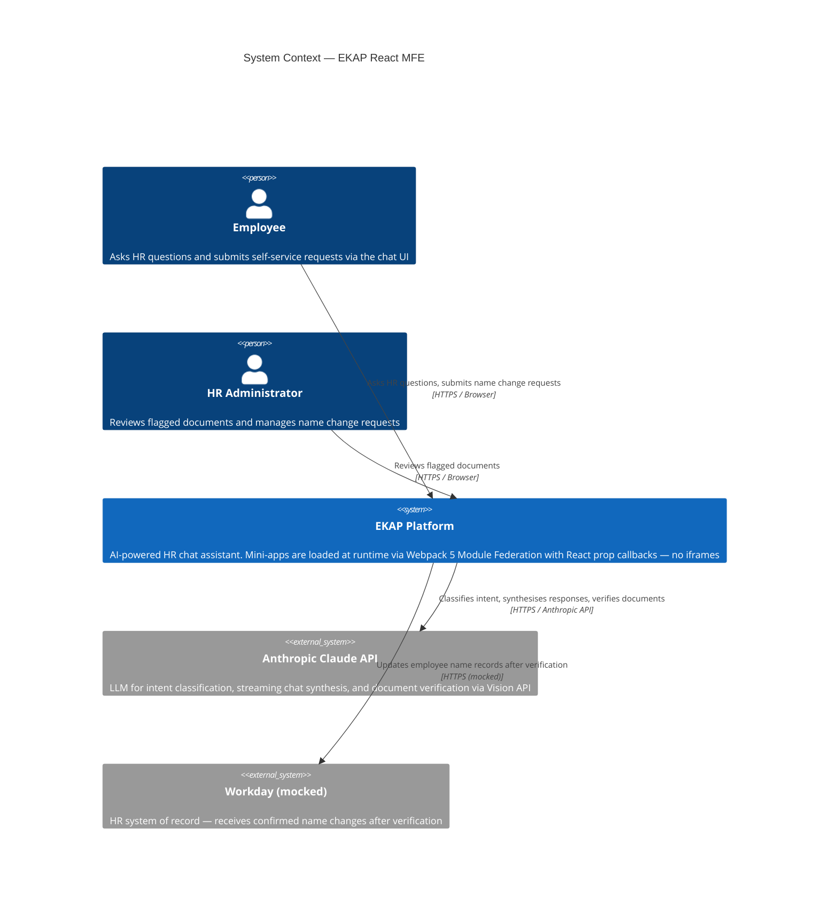
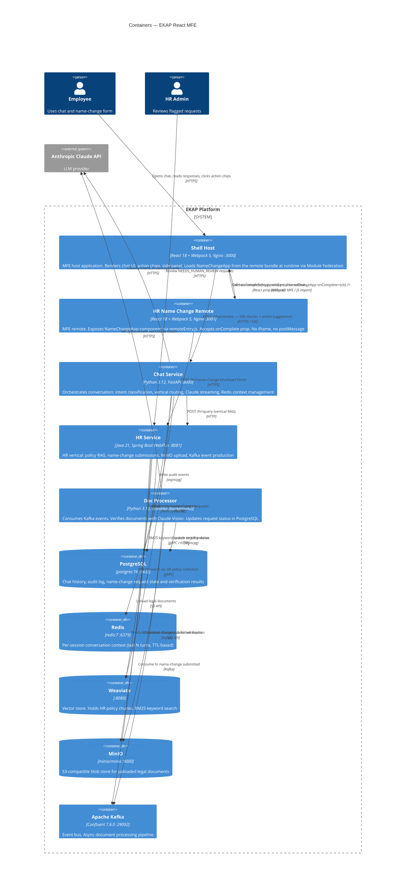
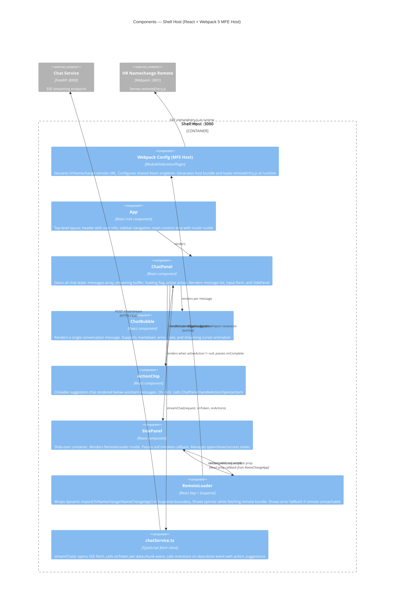
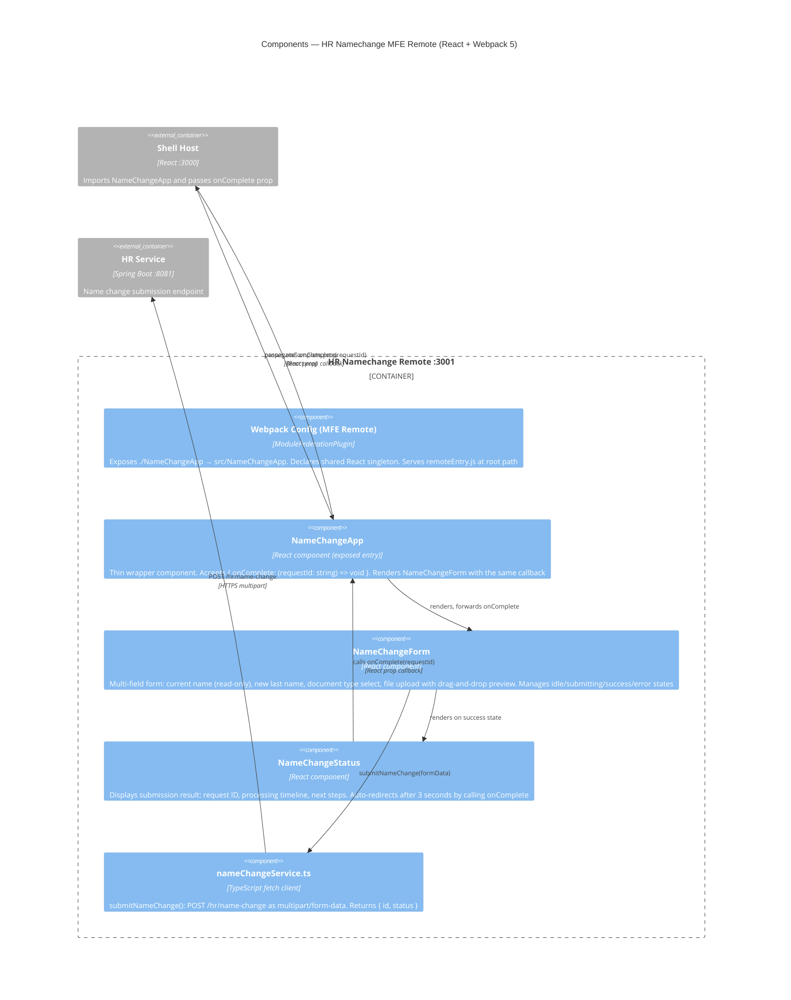
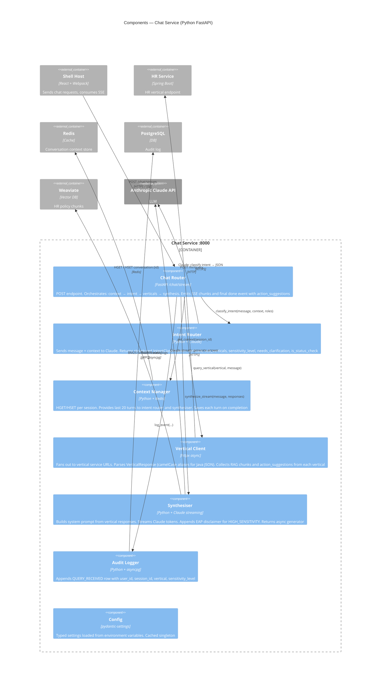
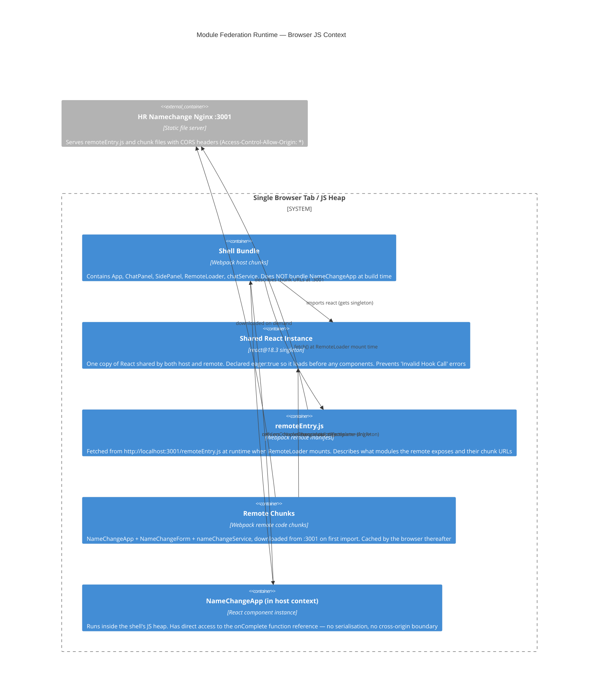
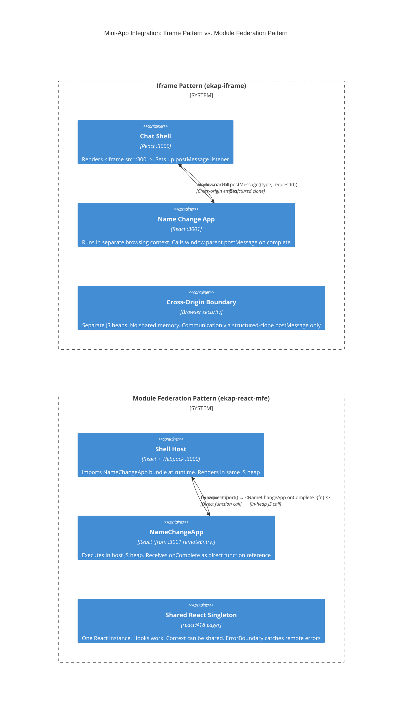

# C4 Architecture — EKAP React MFE

> C4 model levels: **Context → Containers → Components**
> Diagrams use [Mermaid C4](https://mermaid.js.org/syntax/c4.html) and render natively on GitHub.

---

## Level 1 — System Context

Who uses the system and what external systems does it depend on?

---

## Level 2 — Containers

What are the independently deployable / runnable units and how do they communicate?

---

## Level 3 — Components: Shell Host

What are the major internal components of the Shell Host container, and how does it wire up Module Federation?

---

## Level 3 — Components: HR Namechange Remote

---

## Level 3 — Components: Chat Service

---

## Module Federation Runtime Model

This diagram shows what actually happens inside the browser at runtime — the distinction that makes MFE different from an iframe:

---

## Iframe vs. MFE Comparison (C4 Container Level)

